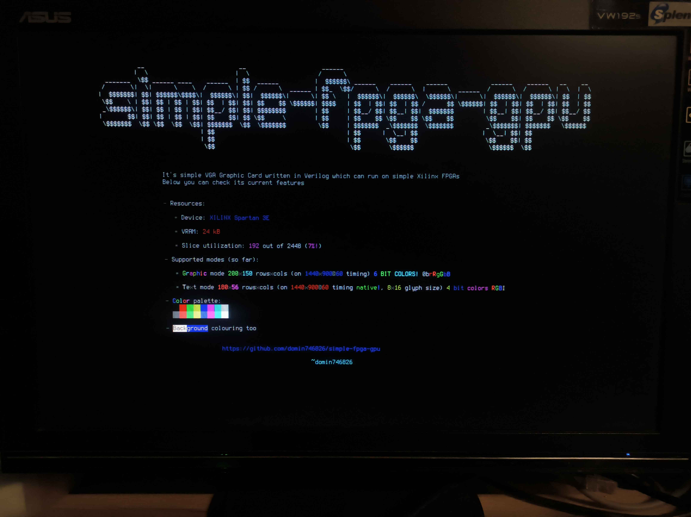
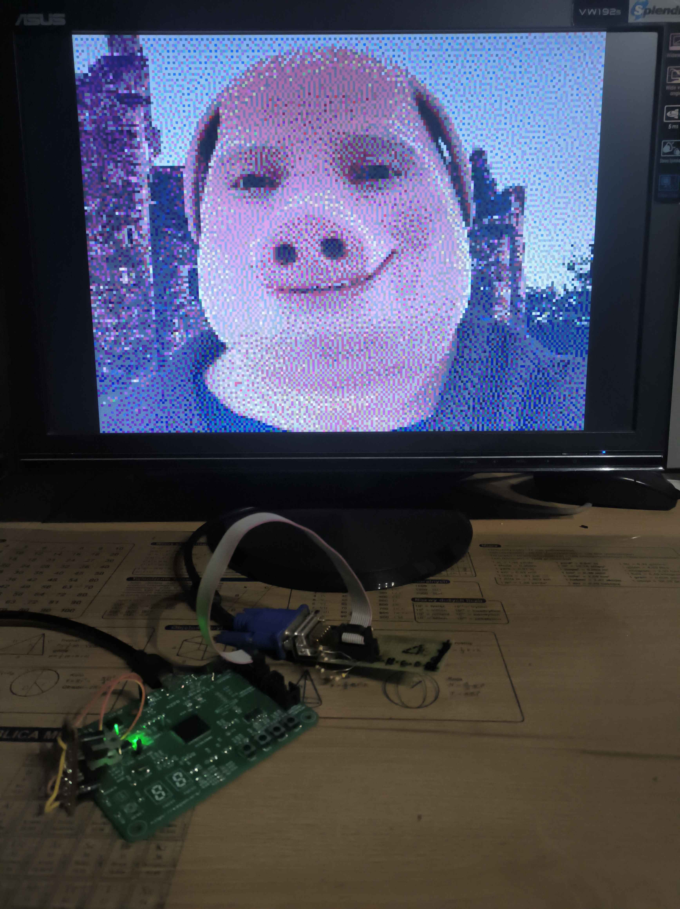
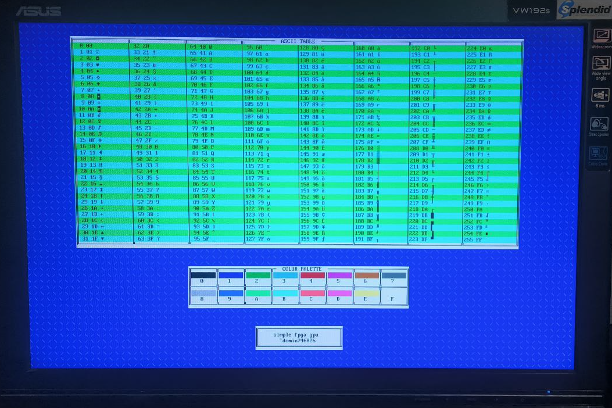

# simple-fpga-gpu

A **very simple GPU** built on **Xilinx XC3S250E** (Spartan-3E).
The goal of this project is to implement a minimal, standalone external **GPU** for FPGA platforms supporting text, graphics, and primitive drawing acceleration which could be used with Arduino and STM32 boards.





---

## Overview

This project implements a simple graphics pipeline entirely in FPGA logic.
It provides a framebuffer-based video output (VGA) and plans to support multiple display modes, text rendering, and hardware-accelerated drawing primitives.


**!!! This is my personal hobby project**

*All Verilog source files were written manually by me (I did not use any form of AI).*
*I used GitHub Copilot only to generate Python scripts because I wanted to focus on writing Verilog code for the FPGA, not on the Python tooling.*
*However, I plan to replace those Python scripts with fully human-written code in the future.*


Currently implemented:
- **200×150 graphics mode** on 1440x900 timing
- **180x56 text mode** on 1440x900 timing
- **6-bit color (RRGGBB)**
- **More timings available**
- Simple VGA output controller
- Simple SPI Controller (set address, send data, get v_counter, send font, change mode)
- Demo project on Raspberry Pi Pico

---

## Build

You need to have ISE installed and specify its path in fpga_project/Makefile. xc3sprog is required to upload or flash.
I use [AZPR EvBoard](https://yone2.net/azpr_evboard/).

```bash
cd fpga_project
make
```

To display something, make sure ftdi_sio module is loaded and then
```bash
python scripts/push.py test_images/your_image.bmp /dev/ttyUSB1
```


You can adjust pinout in fpga_project/azpr_evboard.ucf

---

## Planned Features

| Category | Description |
|-----------|-------------|
| **Graphics Modes** | 256x192@4 Bit color, 2bit Gray/Four color mode 360x225 and more |
| **Text Modes** | (8×16 font, 4-bit color), (16×32 font, 6-bit color) |
| **Image Mode** | Storing image in VRAM in JPEG-like format and live-decoding it every frame (720x450x6bit) |
| **Acceleration** | Hardware line, rectangle, polygon fill |
| **Miscellaneous** | Changing clock and graphic modes on the fly, registers with settings

---

## Roadmap

### Stage 1 — Basic Graphics Mode *(Completed)*
- [x] 200×150 graphics mode, 6-bit color
- [x] Framebuffer in BRAM
- [x] Image converter
- [x] VGA timing generator
- [x] Simple UART test interface

---

### Stage 2 — Interfaces & Memory
- [x] SPI interface (communication with MCU or host)
- [x] VRAM organization (framebuffer + font/tilemap memory)

---

### Stage 3 — Text Modes
- [x] Font converter
- [x] 1440×900, 8×16 font, 4-bit color, fg&bg
- [ ] 1440×900, 16×32 font, 6-bit color, fg&bg

---

### Stage 4 — Extended Graphics / JPEG Mode
- [ ] Basic live JPEG decoder

---

### Stage 5 — Hardware Drawing Primitives
- [ ] Line drawing (Bresenham algorithm)
- [ ] Rectangles (stroke + fill)
- [ ] Polygon filling (scanline-based)
- [ ] Points, redrawing window
- [ ] Command FIFO for queued operations


---

## Notes

This is an experimental educational project for learning **FPGA-based GPU architecture** focusing on low-level rasterization, VRAM management, and hardware command processing. Don't use it for anything serious.
